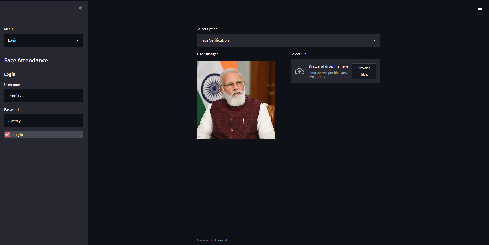
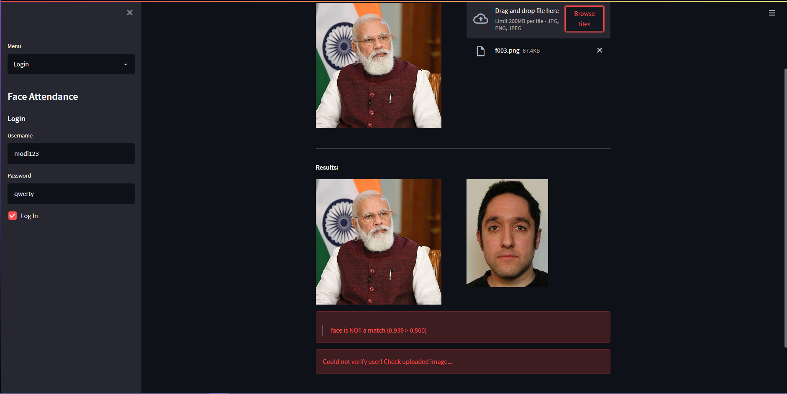
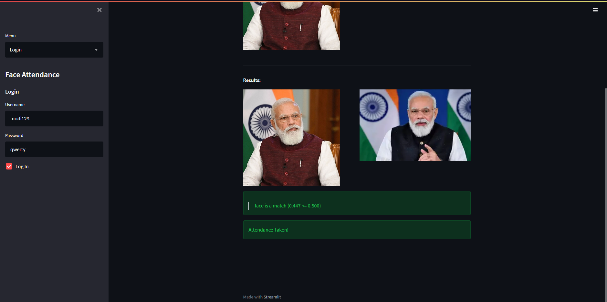

# ML-Project
Machine learning project for creating a face recognition based attendance system.

# Methods used
## Classification
Mobilenet model used for face recognition

## Deep Metric Learning
Siamese Network with contrastive loss used for face recognition

## Program Preview

## How to use:
To use the main program, read the README file in the program folder and follow the steps inside.
Ensure that the requirements are installed using: pip install -r requirements
And to run the program, open a terminal to the folder directory and run this command: streamlit run app.py
